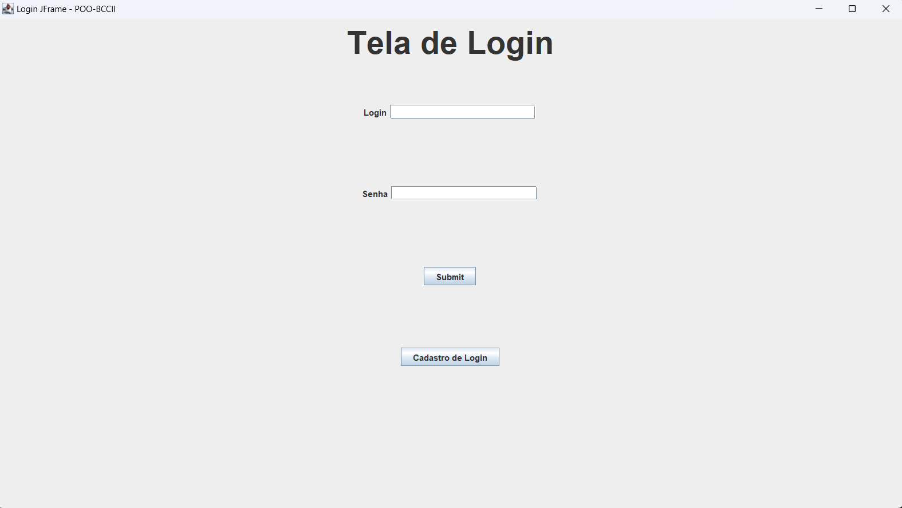
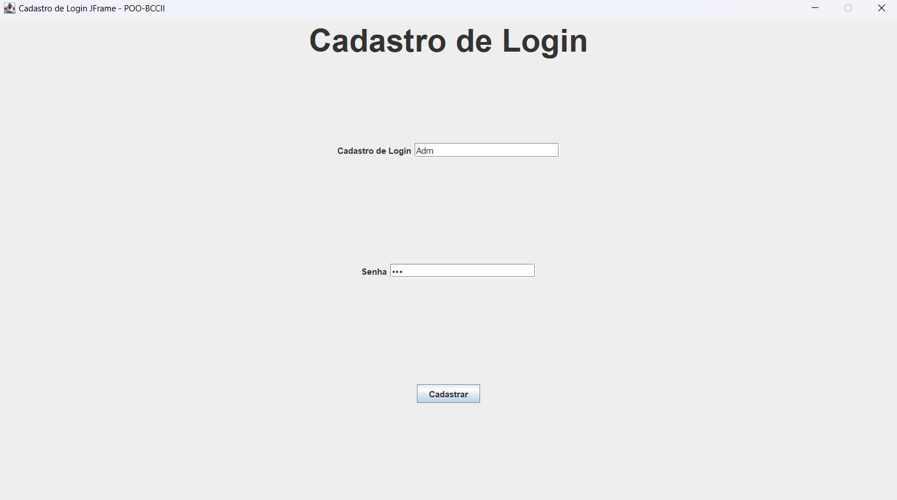
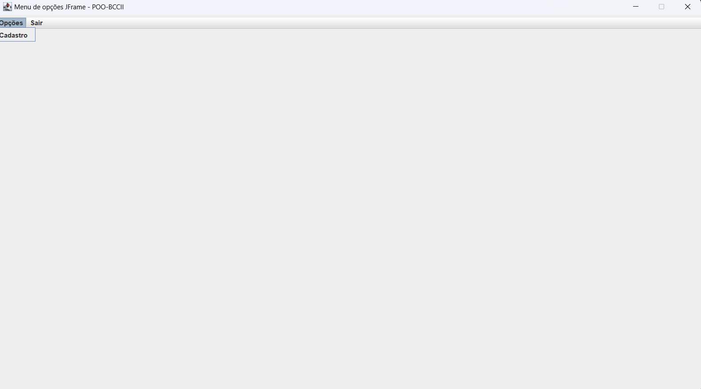
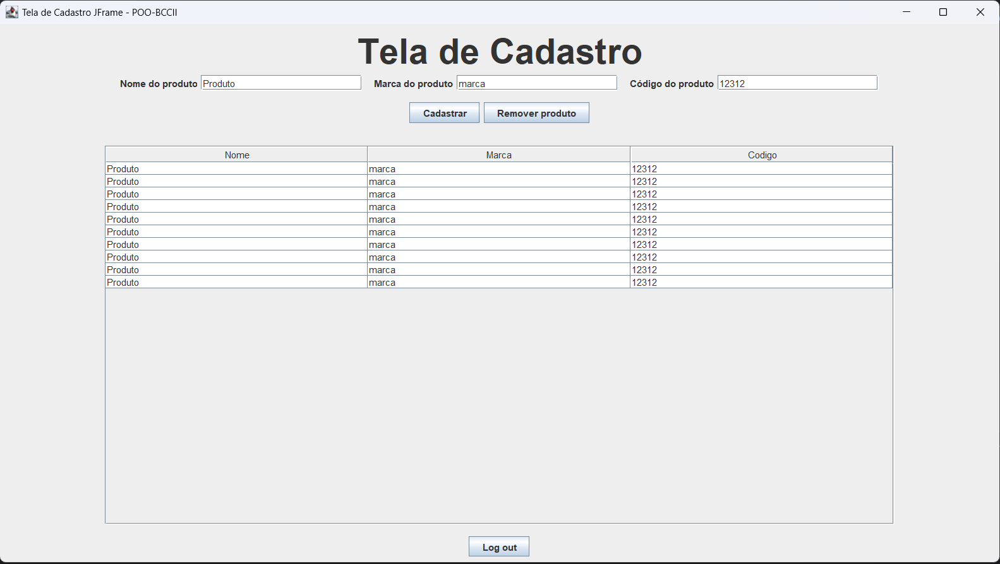

<h1 align="center" style="font-weight: bold;">POO-Project</h1>

<p align="center">
 <a href="#tech">Tecnologias</a> • 
 <a href="#started">Como Rodar</a> • 
  <a href="#colab">Colaboradores</a>
</p>

<p align="center">
    <b>Trabalho para nota 1,2 e 3 para o 2 período</b>
</p>

<p align="center">
     <a href="https://github.com/Coe-Everton/Project-POO">📱 Visite este projeto</a>
</p>

<h2 id="layout">🎨 Layout</h2>

<p align="center">
    
    
    
    

</p>

<h2 id="technologies">💻 Tecnologias</h2>

- Java (JFrame)

<h2 id="started">🚀 Como Rodar</h2>

<h3>Pré-requisitos</h3>

- [intelij](https://www.jetbrains.com/pt-br/idea/download/?section=windows)
- [Java - JDK](hhttps://www.oracle.com/java/technologies/downloads/)

<h3>Cloning</h3>

Como clonar esse repositório

```bash
git clone https://github.com/Coe-Everton/Project-POO.git
```

<h3>Starting</h3>

Como rodar essa repositório


```bash
cd .\src\
javac Main.java
java Main
```

<h2 id="colab">🤝 Colaboradores</h2>

<table>
  <tr>
    <td align="center">
    <h3>Creator<h3/>
      <a href="#">
        <br>
        <sub>
          <b>Everton Caldeira Oliveira</b>
        </sub>
      </a>
  </tr>
</table>